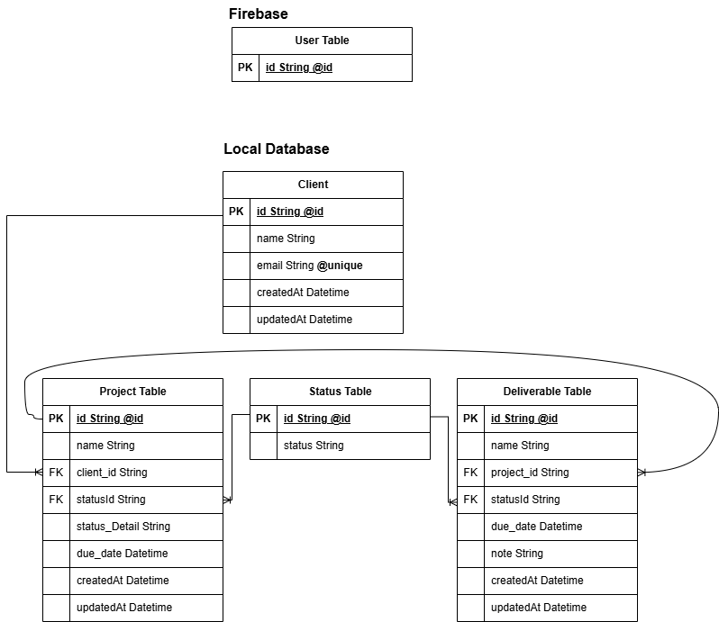

# Client Deliverables Tracker

### Check it out here:
[Live Demo](https://agencyflow-app.vercel.app/)

### Test Account:
Email: admin123@gmail.com
Password: admin123

  
[Frontend Repo](https://github.com/SHREERAJ10/client-delivery-tracker-frontend)
[Backend Repo](https://github.com/SHREERAJ10/client-delivery-tracker-backend)

A fullstack internal tool for small agencies to track clients, projects, and deliverables in one place.

The goal was to build a practical business application that helps agencies keep track of overdue work, upcoming deliverables, and project progress across multiple clients.

## Screenshots

### Database Model



### Dashboard


### Clients & Projects


### Deliverables Management


## Features

### Authentication

- Email/password authentication using Firebase Auth
- No public registration
- Users are created directly from the Firebase Console
- Built with future RBAC support in mind

### Dashboard

- Total clients metric
- Total active projects metric
- Overdue deliverables metric
- Upcoming deliverables metric
- Overdue deliverables table
- Upcoming deliverables table
- Quick add deliverable action
- Search shortcut

### Client Management

- Create, read, update, and delete clients
- Search clients
- Pagination support

### Project Management

- Create, read, update, and delete projects
- Filter projects by status
- Search projects
- Pagination support

### Deliverable Management

- Create, read, update, and delete deliverables
- Filter deliverables by status
- Search deliverables
- Project Health
- Pagination support

### UX Features

- Responsive tables and card layouts
- Skeleton loading states
- Toast notifications for CRUD operations
- Query parameter based search and filtering
- Nested navigation structure
- Progress bar for deliverables completion state
- Basic optimistic UI updates

## Tech Stack

### Frontend

- React
- React Hook Form
- Zod
- Shadcn
- Material UI Autocomplete
- Sonner

### Backend

- Node.js
- Express.js
- Zod
- Prisma ORM
- PostgreSQL

### Infrastructure

- Firebase Auth
- Neon PostgreSQL
- Vercel
- Render

## Database Structure

The application is built around three main entities:

**Client → Project → Deliverable**

A client can have multiple projects.

A project can have multiple deliverables.

## Search

Search is implemented using PostgreSQL `ILIKE` queries.

Given the scale of the application, I chose a simple database search approach instead of full-text search or external search services.

## Technical Decisions

### Query Parameters

Search, filtering, and pagination state are stored in query parameters.

This allows users to bookmark and share specific views.

### URL Structure

Nested routes are used to reflect entity relationships:

```text
/client/:clientId/project/:projectId/deliverable
````

Route parameters act as the source of truth when navigating between related resources.

### Form Handling

React Hook Form and Zod are used for both frontend and backend validation.

This reduced form complexity compared to managing multiple forms entirely through React state.

### Optimistic UI

Local state updates are used to provide immediate feedback before server responses complete.

Full optimistic updates were explored using React's `useOptimistic` hook but were not retained due to API response structure and refetch requirements.

## What I Learned

* API response design
* Avoiding N+1 query patterns
* Search implementation tradeoffs
* Query parameter based state management
* React Hook Form
* Zod validation
* Skeleton loading patterns
* Debouncing concepts
* URL based navigation and routing
* Data ownership and state management
* Race condition and timing-related debugging
* Prisma connection management
* Deploying fullstack applications

## Future Improvements

* Role-based access control
* Full-text search
* Server state management with TanStack Query
* Activity logs
* Notifications
* Advanced filtering